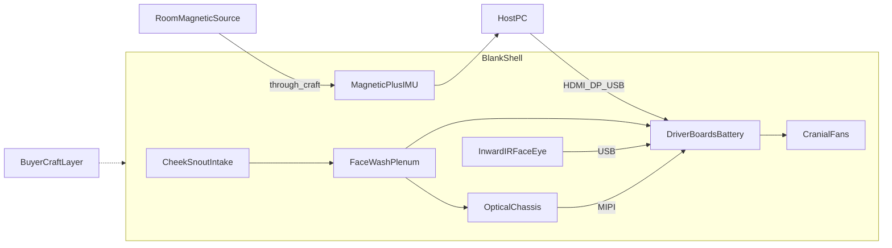

# Fursuit-Integrated DIY VR Headset

Blank, decorateable fursuit-head **shell** — you ship the rigid VR + thermal + pose chassis; buyers foam, fur, and craft the outside into whatever character they want.

## Prototype architecture (locked)

| Subsystem | Choice |
|-----------|--------|
| Displays + optics | Dual **SeeYa 1.03" 2560×2560** Micro-OLED + matching **pancake** modules (OTS kit) |
| IPD | Mechanical rails, **56–72 mm** |
| Compute (v1) | **PC-tethered** via dual HDMI/DisplayPort → MIPI driver boards |
| **World / room pose** | **In-shell magnetic sensor** (occiput bay) + **IMU** — works under fur/foam/craft. Optional in-shell UWB companion. See [docs/world-tracking.md](docs/world-tracking.md) |
| World cameras | Optional only; **not** product pose under decoration |
| Eye / face tracking | **Inward** IR eye + mouth cams (outside craft irrelevant) |
| Cooling | Cheek + snout intake → face-wash plenum → electronics bay → dual **40 mm** cranial exhaust |
| Outer shell | Species-agnostic blank + decoration bosses; **no required exterior tracker windows** |



## Repo layout

```
furry-vr-headset/
  README.md
  docs/           # BOM, blueprints, cooling, tracking, cameras, dimensions
  cad/            # Parametric OpenSCAD sources
  stl/            # Exported meshes for printing
  drawings/       # Orthographic blueprint sheets
```

## Quick start

1. Read [docs/bom.md](docs/bom.md) and order the OTS stack.  
2. Read [docs/world-tracking.md](docs/world-tracking.md) — pose is in-shell, craft-agnostic.  
3. Skim [docs/assembly-blueprint.md](docs/assembly-blueprint.md).  
4. Preview `cad/assembly.scad` in OpenSCAD; export with `cad/export_all.sh`.

## Design intent

- **You build the shell** — optics, cooling, inward face cams, in-shell pose bay.  
- **They decorate** — fur/foam/paint/ears with almost no tracking constraints.  
- **No LiDAR / no under-fur cameras for room pose** — those need clear apertures and fight the craft layer.  
- **Magnetic (+ optional UWB) through craft** — the pose path that stays inside the product.

## Safety notes

- Hard kill switch on battery power.  
- Protected LiPo bay; optional 3010 blower.  
- IR LEDs **850 nm**, current-limited.  
- Prototype engineering package, not a certified wearable.
