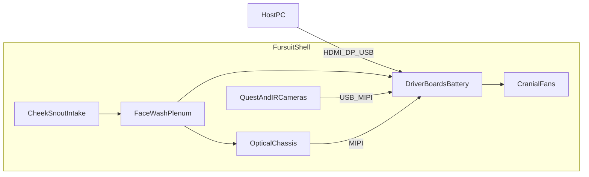

# Fursuit-Integrated DIY VR Headset

Blank, decorateable fursuit-head **shell** that contains a fully DIY VR optical stack, Quest-class tracking/face cameras, and **active ducted cooling**. Prospective buyers/makers fur, foam, and style the outer shell however they want; the inner bay is a fixed VR + thermal chassis.

## Prototype architecture (locked)

| Subsystem | Choice |
|-----------|--------|
| Displays + optics | Dual **SeeYa 1.03" 2560×2560** Micro-OLED + matching **pancake** modules (OTS kit) |
| IPD | Mechanical rails, **56–72 mm** |
| Compute (v1) | **PC-tethered** via dual HDMI/DisplayPort → MIPI driver boards (standalone SoC later) |
| World tracking cameras | **4× Quest 2/3-class** harvested modules *or* OTS OV7251/OV9282 global-shutter boards |
| Eye / face tracking | **2× IR eye cams + 1–2× lower-face IR cams** (Quest Pro / EyeTrackVR / Project Babble class) |
| Cooling | Cheek + snout intake → face-wash plenum → electronics bay → dual **40 mm** cranial exhaust (+ optional 3010 battery blower) |
| Outer shell | Species-agnostic blank with decoration bosses and hidden camera apertures |



## Repo layout

```
furry-vr-headset/
  README.md
  docs/           # BOM, blueprints, cooling, cameras, dimensions
  cad/            # Parametric OpenSCAD sources
  stl/            # Exported meshes for printing
  drawings/       # Orthographic blueprint sheets
```

## Quick start

1. Read [docs/bom.md](docs/bom.md) and order the OTS stack.
2. Skim [docs/assembly-blueprint.md](docs/assembly-blueprint.md) for stack-up order.
3. Open `cad/assembly.scad` in [OpenSCAD](https://openscad.org/) to preview.
4. Export printable parts:

```bash
cd furry-vr-headset/cad
chmod +x export_all.sh
./export_all.sh
```

5. Print shell in large segments (or split), PETG/ABS for ducting near fans; optical carriers in PETG.

## Design intent

- **Contained headset** — wearer sees only lenses; batteries, boards, fans, and cameras live inside the head.
- **Blank shell** — decoration bosses + smooth outer hull; fur/foam/ears are out of scope of the rigid kit.
- **Thermal first** — fursuit heads trap heat; airflow is a first-class subsystem, not an afterthought.
- **Headset-parts reuse** — camera pockets sized for harvested Quest tracking modules, with adapters for OTS global-shutter boards.

## Safety notes

- Use a **hard kill switch** on battery power.
- Keep LiPo packs in a protected bay with the optional blower; never crush cells with foam.
- IR LEDs must be **850 nm**, current-limited; avoid 940 nm-only emitters if your cameras need 850 nm.
- This is a prototype engineering package, not a certified wearable product.
