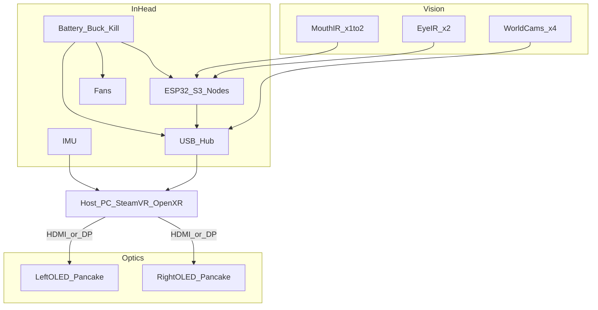

# System architecture

## Goals

1. Fully **DIY** VR image path (not a Quest stuffed in a mask).
2. Reuse **Quest-class cameras** for world tracking and face/eye pipelines where possible.
3. Ship a **blank shell** others can fur/foam without touching the VR bay.
4. Build **active cooling into the head**, not clip-on fans after the fact.

## Coordinate system

Used in all CAD and drawings:

- **+X** — wearer’s right  
- **+Y** — toward back of head (occiput)  
- **+Z** — up  
- Optical chassis origin ≈ midpoint between eyes, slightly forward of face plane  
- Snout is **−Y**

## Layers (outside → inside)

1. **Decoration layer** (buyer) — fur, foam, paint, ears, whiskers. Attaches to decoration bosses / glue pads only.
2. **Outer shell** — rigid printed blank; world-camera apertures; intake/exhaust grills.
3. **Cooling ducts** — cheek scoops, face-wash plenum, electronics shroud, fan shrouds.
4. **Optical chassis** — dual pancake modules on IPD rails; eye/mouth IR mounts.
5. **Face interface** — foam gasket plate, IR LED rings, light seal.
6. **Wearer**

## Data paths

## Software bring-up order

1. Display only — OpenHMD / Monado / vendor distortion shader with pancake profiles.  
2. IMU head pose — HadesVR / OpenVR driver style 3DoF.  
3. IR face — Project Babble + EyeTrackVR → VRCFaceTracking / OSC.  
4. **World pose** — SteamVR lighthouse tracker on mast (or magnetic); fuse with IMU.  
5. Optional clear-aperture world cameras — Basalt / OpenVSLAM only if nose/mesh windows stay fur-free.  
6. Harvested Quest modules — after MIPI bridge hardware exists; not the fur-product pose source.

## Why pancake modules inside a fursuit head

Fursuit heads are deep, but the wearer’s face still needs eye relief and a light seal. Pancake stacks keep the rigid optical brick short (~28 mm), leaving volume for ducts, boards, and snout styling. Aspheric phone-LCD designs work as a cheaper fit-check dummy (swap envelopes in `params.scad`) but fight heat and weight.
