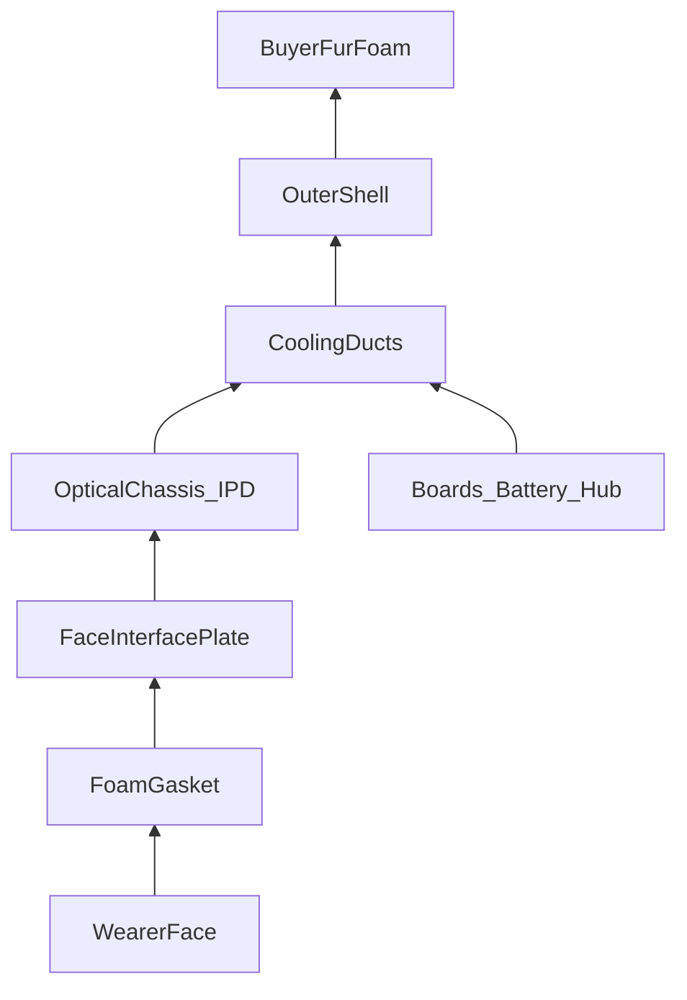

# Assembly blueprint

Printable parts and stack-up for prototype v1. See [dimensions.md](dimensions.md) for numeric callouts and [drawings/orthographic.md](../drawings/orthographic.md) for views.

## Printed parts

| STL | Material | Notes |
|-----|----------|-------|
| `shell_outer.stl` | PETG / ABS-PC | Split into snout / cranial / jaw if bed is small |
| `optical_chassis.stl` | PETG | Include both IPD carriers |
| `face_interface.stl` | PETG | Light-tight to foam |
| `cooling_ducts.stl` | PETG | Separate pieces; CA or M2 join |
| `camera_mounts.stl` | PETG | 4× Quest cradles, adapters as needed |

## Stack-up order

## Step-by-step

### A. Optical brick

1. Press M3 heat-set inserts into IPD carrier corners and chassis face-plate bosses.  
2. Seat each SeeYa pancake module in a carrier; secure with M3×6.  
3. Slide carriers onto the two smooth M3 rails; thread the center IPD lead screw with opposing nuts so turning widens/narrows IPD.  
4. Mount IR eye brackets at temporal pockets; mount mouth camera shelf.  
5. Cable-tie MIPI/HDMI flexes toward the **+Y** electronics bay (never across lens apertures).

### B. Face interface

1. Install IR LEDs in the ring holes; series resistors on a small PCB behind the plate.  
2. Screw plate to chassis (−Z face) with four M3×12.  
3. Glue EVA foam into the retention channel; cut eye holes using the foam guide ring.

### C. Cooling

1. Install cheek scoops against shell inner walls; seal with foam tape.  
2. Clip face-wash plenum to the front of the electronics shroud.  
3. Mount dual 40 mm fans in cranial shrouds — **exhaust out the top**.  
4. Optional: 3010 blower over battery bay, exhausting to occiput slot.  
5. Verify continuous path: cheek/snout → face → bay → fans (hold tissue at exhaust).

### D. Cameras

1. World cams: drop harvested Quest modules into upper/lower L/R cradles; route flexes through channels into the bay.  
2. If using OTS 24×24 boards, print `ots_gs_camera_adapter` and seat adapters in the same shell pockets.  
3. Aim: upper pair slight down (~15°), lower pair nearer horizontal; yaw ~35° outward.  
4. Face cams: eyes look at each eyeball; mouth cam looks at lips/jaw from below the light seal.

### E. Shell close

1. Slide optical + duct assembly into the VR bay pocket until face plate sits at design eye relief.  
2. Secure chassis to shell bosses (M3).  
3. Fit neck pad; route tether (if any) and kill-switch wiring out the neck opening.  
4. Hand shell to decorator — only bosses and marked glue zones are attachment-safe.

## Critical alignments

| Item | Spec |
|------|------|
| Lens centers | On IPD line; height matched ±0.5 mm |
| Eye relief | ~12 mm from pancake exit to cornea |
| Face foam compression | 3–6 mm when worn |
| World cam baseline | See `params.scad` `world_cam_*` |
| Fan direction | Exhaust cranial; never reverse without redesigning ducts |

## Wiring map (abbreviated)

| From | To | Cable |
|------|----|-------|
| Left/right MIPI boards | Host GPU | HDMI/DP (tether) or wireless kit later |
| USB hub | Host | USB3 tether |
| ESP32 nodes | Hub | USB-C |
| IMU | Hub / MCU | USB or I2C→USB |
| Fans + IR | 5 V buck | 26–28 AWG |
| Pack | Kill switch → buck | Silicone power wire + fuse |
