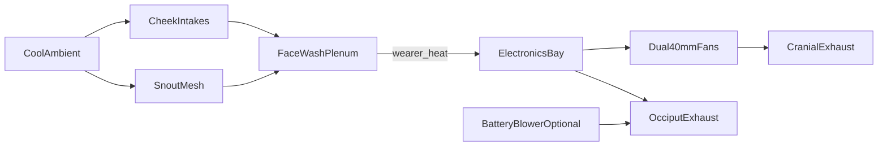

# Active cooling design

Fursuit heads are heat traps. This kit treats airflow as structural: ducts are printed into the shell bay, not added later.

## Air path

1. **Intake** — left/right cheek slots + snout mesh pull cooler room air.  
2. **Face wash** — plenum dumps air across brow/cheek foam so the wearer’s skin is not stagnant.  
3. **Electronics bay** — same airstream sweeps display drivers, hub, and MCU.  
4. **Exhaust** — two 40 mm fans push out the crown; occiput slot is a passive assist / blower exit.

## Targets (prototype)

| Metric | Target |
|--------|--------|
| Face skin ΔT vs ambient | ≤ 8 °C after 30 min idle in shell |
| Driver IC case temp | ≤ 70 °C |
| Acoustic | Prefer ≤ 35 dBA at ears (fan curves / foam baffles) |
| Filter | Speaker cloth over intakes; serviceable |

## Fan configuration

- Default: both cranial fans **exhaust**.  
- Do **not** set one intake / one exhaust through the crown — that short-circuits the face path.  
- PWM both fans from MCU; ramp with IMU activity or a simple NTC in the bay.

## Thermal layout rules

- Keep LiPo in occiput bay with air gap; optional 3010 blower.  
- Put high-watt driver ICs in the duct throat under the fans.  
- Avoid blocking cheek intakes with thick cheek fur — decorator guidance: mesh windows or sparse fur over marked intake zones.  
- World-camera apertures are tiny (Ø4.5); they are not intakes.

## Validation checklist

- [ ] Tissue test at crown exhaust with shell closed  
- [ ] Smoke / incense pencil through cheek slot confirms face-first path  
- [ ] 30 min wear test with temp logger at brow foam and driver IC  
- [ ] Kill switch cuts fans + IR + hub (displays may be host-powered)
