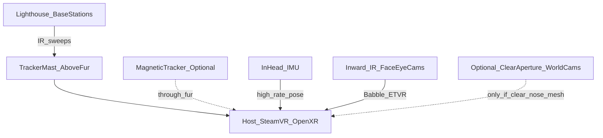

# World / headset tracking (through fur)

## Short answer

**LiDAR will not track real space through fur.** Neither will normal tracking cameras if fur covers their apertures. Fur is a volumetric scatterer: hairs return wrong depths, kill signal-to-noise, and block line of sight. The same failure mode hits:

- RGB / global-shutter SLAM cameras (Quest-style)
- iToF / dToF LiDAR and structured light (Quest 3 depth, RealSense, iPhone LiDAR class)
- “Hidden under the pile” sensors of any optical kind

Optical sensors only work if they have a **clear window** (hard plastic nose, mesh eye, ear-tip mast) with fur kept out of the FOV.

Face/eye cameras are unaffected — they look **inward** at the wearer, inside the light seal.

## What to use instead (recommended)

### Primary (prototype v1): outside-in optical on a clear mast

Mount a **SteamVR Lighthouse / Tundra / Vive tracker** (or a DIY photodiode constellation) on a rigid **ear / horn / dorsal mast** that sticks **above the fur line**.

| Why it wins | Detail |
|-------------|--------|
| Proven in fursuit / prop VR | Community builds already do this |
| Fur-agnostic if sensors see base stations | Only the mast tip must stay clear |
| Good absolute 6DoF in a prepared room | Two base stations, calibrated play space |
| Decoration-friendly | Mast can be an ear core, horn, antenna, or “hair spike” |

CAD: `cad/tracker_mast.scad` — Ø flat for a Vive/Tundra-style puck + cable pass into the cranial bay.

### Strong alternative: magnetic tracking

AC/DC magnetic trackers (e.g. Polhemus-class, or DIY electromagnetic) **do go through fur, foam, and fabric** because the field does not need an optical aperture.

| Pros | Cons |
|------|------|
| True “under the fur” 6DoF | Cost; metal in room distorts; limited range |
| No fur windows | Calibration / distortion mapping needed |
| Clean exterior styling | Less common in SteamVR hobby stacks |

Use this if the buyer must have **zero** visible tech and can control the metal environment (convention floors are hostile; home/stage is fine).

### Do **not** rely on for absolute room pose

| Approach | Verdict under fur |
|----------|-------------------|
| Inside-out Quest cameras in the shell | Fail unless large clear windows (breaks “hidden” look) |
| LiDAR / ToF under fur | Fail — multipath on hair |
| Pure IMU | Drifts; OK only for minutes with frequent optical/magnetic corrections |
| SlimeVR-style body IMUs alone | Great for body; **not** a full headset room reference |

## Recommended hybrid stack

1. **Absolute pose:** Lighthouse tracker on mast (default) *or* magnetic sensor in occiput.  
2. **High-rate filter:** in-head IMU fused on the host.  
3. **Avatar face:** inward IR cams (unchanged).  
4. **Optional passthrough / near SLAM:** only behind intentional clear apertures (hard nose tip, eye mesh) — never as the only pose source under full fur.

## Fur / decorator rules

- Keep a **≥40 mm clear hemisphere** around lighthouse sensors / photodiodes on the mast tip.  
- If you insist on shell world cams: hard plastic or screen mesh over the aperture; **no** long pile in the cone.  
- Do not mount LiDAR under cheek fur expecting room mesh — it will see hair.  
- Metal zippers, wire ear armatures, and steel fans near a magnetic tracker need keep-out distance (see vendor distortion docs).

## BOM add-ons (tracking)

| Qty | Part | Notes |
|-----|------|-------|
| 1 | Tundra Tracker / Vive Tracker 3.0 / similar | Mounts on `tracker_mast` |
| 2 | SteamVR Base Station 1.0 or 2.0 | Room setup |
| 1 | *Alt:* magnetic source + sensor | If going no-mast |
| 1 | USB or pogo pass-through in mast | Power/data into bay |

## Design decision (locked)

**Primary world tracking = outside-in tracker on a clear mast (or magnetic).**  
Shell Quest-class cameras remain in the kit for experiments, passthrough research, and future clear-aperture SKUs — **not** as the fur-covered product’s pose source.
