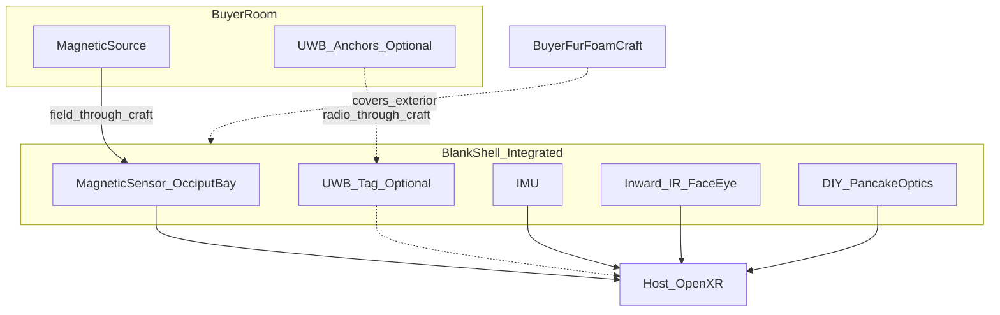

# World / headset tracking (blank decorateable shell)

## Product constraint

This kit is the **inner shell only**. Buyers will foam, fur, paint, add ears/horns/whiskers — arbitrary arts and crafts on the outside. Tracking therefore must:

1. Live **inside the shell** (no required mast, horn tip, or clear window).  
2. Keep working when the exterior is fully covered.  
3. Impose almost no decorator rules beyond “don’t pack the occiput full of steel.”

Optical SLAM, Quest-style world cams, and **LiDAR all fail under pile fur**. They are not the product pose source.

## Locked primary: in-shell magnetic + IMU

**Magnetic (EM) tracking** is the pose system that matches a blank craftable shell. The sensor sits in a dedicated **occiput pose bay** under the plastic; the room has a small magnetic source (desk / wall / ceiling mount). Fur, foam, fabric, resin, and most craft plastics are invisible to the field.

| | |
|--|--|
| **In the shell** | Magnetic sensor capsule + high-rate IMU (already in electronics bay) |
| **In the room** | Magnetic source / emitter base (buyer environment gear, like base stations but RF/magnetic) |
| **Host** | Fuse magnetic pose + IMU → OpenXR/SteamVR driver |

| Pros | Cons |
|------|------|
| Fully under-fur / under-foam | Room metal distorts (file cabinets, rebar, steel fans nearby) |
| Zero exterior apertures | Range typically room-scale / stage-scale, not warehouse |
| Decorator-agnostic exterior | Source hardware cost vs lighthouse pucks |
| Integrates in `pose_sensor_bay` | Needs distortion calibration in messy rooms |

### Secondary / companion: in-shell UWB tag

**Ultra-wideband** radio tags (DWM3000-class) also live entirely inside the shell and see through fur. Use as:

- Backup or large-space position when magnetic is ugly (convention halls), or  
- Dual system: UWB for position, magnetic or IMU for orientation.

UWB alone is usually weaker at high-rate orientation than magnetic+IMU; treat it as a fused companion, not a solo headset tracker, unless you run a dense anchor net.

## What is explicitly *not* required on the outer craft layer

- No clear camera windows  
- No LiDAR portholes  
- No lighthouse mast that must poke above fur  
- No “don’t cover this logo zone” for pose to work  

Optional `tracker_mast.stl` remains in the repo only for advanced buyers who *choose* SteamVR lighthouse — it is **not** part of the base shell product contract.

## Decorator contract (short)

Allowed freely: fur, foam, paint, resin, fabric ears/horns, plastic armatures, glue, most adhesives.

Avoid in/near the **occiput pose bay keep-out** (marked in CAD / sticker in kit):

- Large ferrous masses (steel plates, thick iron wire bundles)  
- Putting the magnetic sensor against a steel fan frame (fans stay in their cranial mounts; bay is offset)  

Aluminum zippers and small brass findings are usually fine; solid steel skullcaps are not.

## System diagram

## Software bring-up

1. IMU orientation streaming (always on).  
2. Magnetic sensor → host driver; calibrate soft/hard iron + room distortion.  
3. Optional UWB anchors → fuse position.  
4. Publish fused headset pose to OpenXR/SteamVR.  
5. Face/eye pipelines unchanged (inward cameras).

## Design decision (locked)

| Layer | Choice |
|-------|--------|
| Product room pose | **In-shell magnetic sensor** in occiput bay + **IMU fusion** |
| Companion | Optional **in-shell UWB** tag |
| Not product pose | LiDAR, under-fur cameras, required lighthouse mast |
| Buyer craft exterior | Unconstrained except occiput ferrous keep-out |

CAD: [`cad/pose_sensor_bay.scad`](../cad/pose_sensor_bay.scad) — mounts inside the shell; no exterior breakout.
